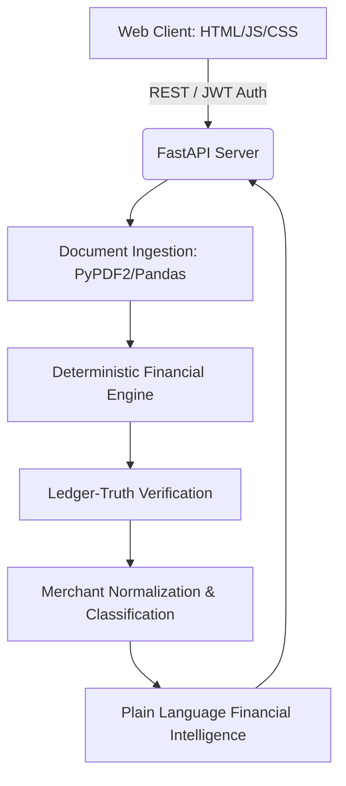

<div align="center">
  
  
  
  
  
  
  
  
  
</div>

<h1 align="center">Lens Shtar</h1>
<p align="center">
  <strong>A Fintech Grade Financial Intelligence Engine</strong><br>
  Engineered by <strong>Akshat Kumar</strong>
</p>

## 🌌 The Problem Space

**Why do people struggle to track where their money goes each month?**

In today's fragmented financial landscape, individuals frequently lose control over their spending. Transactions are scattered across diverse channels—UPI apps, credit/debit cards, digital wallets, and overlapping subscriptions. The result? There is **no single, simplified view of everyday expenses** translated into plain, actionable language. 

### Opportunity Metrics
| Metric | Score (out of 10) | Description |
| :--- | :---: | :--- |
| **Severity Score** | `8.0` | High pain point for users managing multiple fragmented accounts. |
| **TAM Score** | `10.0` | Total Addressable Market spans almost all active digital spenders. |
| **Whitespace Score** | `8.0` | Existing solutions are often overwhelming, inaccurate, or lack deterministic insights. |
| **Frequency Score** | `8.0` | Daily transactions lead to continuous relevance. |
| **🔥 ITCH SCORE** | `90.5` | **Critical need for a unified, secure, intelligent solution.** |

---

## 🚀 How We Solved It

Lens Shtar tackles this problem head-on through a meticulously designed deterministic pipeline. Rather than dumping raw transaction data into a black-box LLM (which often leads to hallucinations and incorrect math), Lens Shtar relies on a **strict Python-based rule engine**.

### 1. The Ledger-Truth Engine
All financial flows are subjected to rigorous mathematical verification. We ensure a foundational "ledger truth" that guarantees 100% accuracy in balances, debits, and credits before any analysis is allowed to happen.

### 2. Transaction State Machine & Cleansing
Data flows through a multi-stage validation pipeline:
*   **Ingestion:** Support for banking PDFs (parsed securely via `pdfplumber`/`PyPDF2`) and Excel sheets to handle any bank format.
*   **Normalization:** Merchant names and transaction locations are intelligently isolated from the noisy transaction rails (e.g., removing arbitrary bank codes, terminal IDs).
*   **Classification:** Rules-based classification assigns transactions into logical categories that reflect reality.

### 3. Human-Readable Insights
Only after passing the rigorous reconciliation and deterministic engine constraints do we generate insights. This ensures **fintech-grade trust & data integrity**. The user is presented with beautifully rendered, unified, and easy-to-understand visualizations of their cash flow.

---

## 🛠 Technologies & Workflow

The architecture is built for extreme performance, security, and immediate responsiveness. We employ a decoupled SPA-to-API workflow ensuring a premium user experience.

### System Architecture



*   **Frontend (Static Web):** Ultra-lightweight Vanilla DOM (JavaScript + HTML5/CSS3) for instant load times and native-like responsiveness. Served locally from the `frontend/` folder for rapid testing and performance.
*   **Backend (Python + FastAPI):** A local-first, asynchronous backend layer optimized for speed and reliability. Built-in CORS and dependency injection.
*   **Data Science & Parsing:** Heavy lifting powered by `Pandas`, `openpyxl`, `PyPDF2`, and `pdfplumber` to extract actionable rows from complex unstructured banking reports.
*   **Security:** Cryptographically secure `PyJWT` authentication blocks ensuring data remains private and accurately tied to user sessions.

---

## 📂 Project Structure

A clean, modular layout guaranteeing zero overlap between presentational components and heavy data-processing scripts.

```text
lens-shtar/
├── backend/                  # Fast & Secure Python API Layer
│   ├── app/                  # Application core modules (Analysis, Pipeline, Validation)
│   ├── requirements.txt      # Python dependencies
│   ├── start.py              # Server entry point
│   ├── .env                  # Environment configurations
│   └── .venv/                # Isolated Virtual Environment
├── frontend/                 # Frontend application and static assets
│   ├── index.html            # Single Page Application entry
│   ├── css/                  # Premium frontend styling
│   ├── js/                   # Vanilla frontend logic and API controllers
│   ├── package.json          # Frontend tooling and start scripts
│   ├── package-lock.json     # Node dependency lockfile
│   └── node_modules/         # Installed frontend dependencies
├── environment.yml           # Conda environment definition for deep compute tasks
├── start_all.sh              # Single-command workflow initiation
└── start_backend.sh          # Backend startup helper
```

### Quick start

From the project root:

```bash
cd frontend
npm install
npm start
```

Then open `frontend/index.html` or use the browser URL shown by the local server.

---

<p align="center">
  <em>“Empowering individuals with mathematical truth and financial clarity.”</em>
</p>
